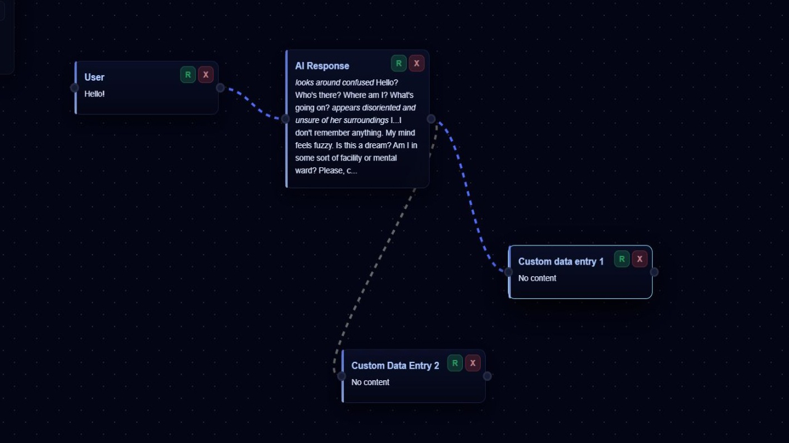

# FlowChat

This is a minimalist Ollama chat interface that uses a flowchart to visualize the logic of your input.

The interface is designed to provide a more intuitive way to interact with the chatbot by allowing users to see the flow of their conversation.

Key features include:

Resending inputs.

Reviewing and editing nodes (both the LLM's responses and the user's inputs) to merge information and generate different responses.

The ability to save the graph as JSON and load it to continue your workflow.

You can test it here: https://soulllink.github.io/ChatFlow/
